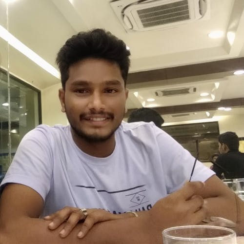

# Hi there, I Am Narasimhulu Vasam 👋

- Proficient in MERN stack ...
- I’m actively looking for a Front End Developers Role.
- Passionate about implementing and launching new projects ...
- Ability to translate business requirements into technical solutions.
- Looking to start the career as an entry-level software engineer with a reputed firm driven by technology ...
- I enjoy learning new skills and implementing them in real life! ...

## Languages and Tools

  

<!--         -->

        

    

<article >

<!--  -->

</article>

   
  

  <!-- <article> -->

 

  <!-- </article> -->
